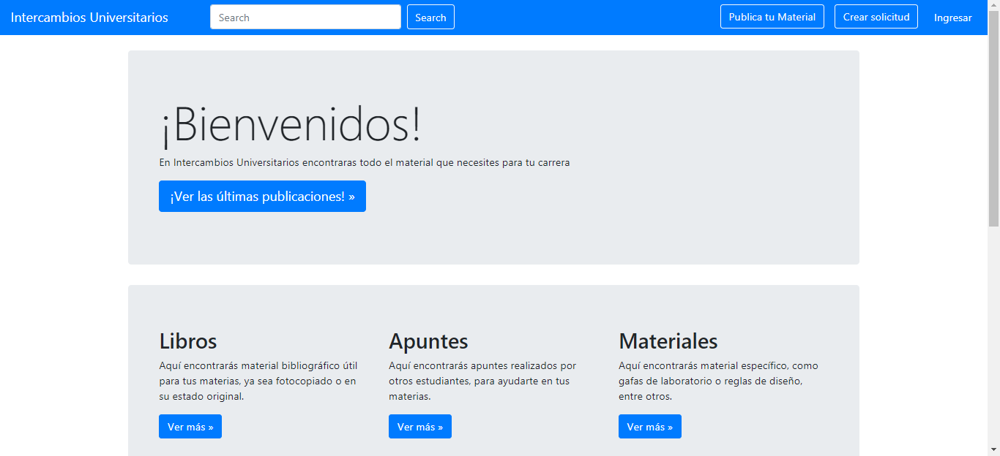

#  Ingeniería de Aplicaciones - Proyecto Final

Proyecto web para la materia Ingeniería de Aplicaciones, de la carrera de Ingeniería en Computación en la **Universidad Nacional del Sur**.

### Equipo de Trabajo
* Benamo, Sebastian
* Catalfamo, Salvador
* Salazar Gisbert, Gabriel

### Tecnologías Utilizadas
* Laravel 5.7
* Angular 7.0.2
* Bootstap 4.1
* MySQL
* PHP 7.2

### Apis
* Google Auth
* Algolia
